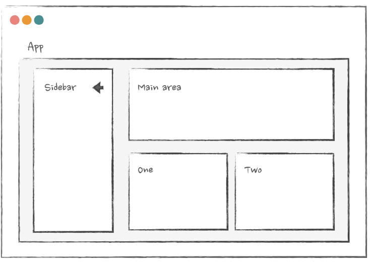

 # Context
 
 


Source: [Advanced React](https://www.advanced-react.com/)

Support we have a page with sidebar and main content area. Left side of our application will be collapsable sidebar. On 
button click it will collapse on narrow view and expand on wide view.
```jsx
const Page = () => {
    return (
        <Layout>
            <Sidebar />
            <MainPart />
        </Layout>
    );
};
```
```jsx
const Sidebar = () => {

    return (
        <div className="sidebar">
            {/* this one will control the expand/collapse */}
            <ExpandButton />
            {/* ... other sidebar stuff */}
            <Link ... />
            <Plugin ... />
            </div>
    )
}
```
`AdjustableColumnsBlock` will have 2 or 3 column depends on sidebar is expanded or collapsed.
```jsx
const MainPart = () => {
    return (
        <>
            <VerySlowComponent />
            <AnotherVerySlowComponent />
            {/* this one needs to know whether the sidebar is expanded or collapsed */}
            {/* it will render two or three columns, depending on this information */}
            <AdjustableColumnsBlock />
        </>
    );
};
```
If we take a state `isNavExpanded` then we will need to pass that from `Page.jsx` to `Sidebar.jsx` => `ExpandButton.jsx`.
`Page.jsx` => `MainPart.jsx` => `AdjustableColumnsBlock.jsx`. This is not good solution 

1. **Extra Props:**`Sidebar` and `MainPart` has props those are not used by them. 
2. **Props Drilling:** If we want to add another component between `Sidebar` and `MainPart` then we need to pass that prop to that component 
   as well. This is called prop drilling. 
3. **Performance:** If the `isNavExpanded` is change value then `VerySlowComponent` and `AnotherVerySlowComponent` will re-render. This 
   is not good for performance. As a result expanding/collapsing the sidebar will be very slow. We can memorize those two
   component but that will be a hacky solution and code will be less maintainable.


# Context API
In this case context(or context like solution like redux) is a good solution. We can directly pass the state to any
component without passing it through intermediate components.
* Context consumers will re-render when the value on the `Provider` changes.
* All of them will re-render, even if they don't use the part of the `value` that actually changed.
* This re-renders can't be prevented with memoization (easily).
* If the controller component(where context logic is written) is re-rendered but the state is not changed then all the 
  children components will re-render although they don't use the context value/state.

We will use children as prop in `NavigationController` component. Inside `NavigationController` we will have a state 
`isNavExpanded` and a function `toggle` to toggle the state. We will pass the `isNavExpanded` and `toggle` function to 
the children components using `Context.Provider`. Will wrap the `Page` component with `NavigationController` component. 
```tsx
const NavigationController = ({ children }: { children: ReactNode }) => {
    const [isNavExpanded, setIsNavExpanded] = useState(false);

    const toggle = () => setIsNavExpanded(!isNavExpanded);
    const value = { isNavExpanded, toggle };

    return <Context.Provider value={value}>{children}</Context.Provider>;
};
```
None of the component will re-render if `isNavExpanded` is changed(`Layout`, `Sidebar`, `VerySlowComponent`, 
`AnotherVerySlowComponent`). . Only the components that use `useNavigation` hook will re-render(`AdjustableColumnsBlock`,
`ExpandButton`).

`very-slow-component.tsx`
```tsx
const wait = (ms: number) => {
  const start = Date.now();
  let now = start;

  while (now - start < ms) now = Date.now();
};

export const VerySlowComponent = () => {
  wait(400);
  return null;
};

export const AnotherVerySlowComponent = () => {
  wait(400);
  return null;
};
```
`App.tsx`
```tsx
import React, { ReactNode, useContext, useState } from 'react';

import { AnotherVerySlowComponent, VerySlowComponent } from './components/very-slow-component';
import './styles.scss';

const Context = React.createContext({
  isNavExpanded: false,
  toggle: () => {},
});

const NavigationController = ({ children }: { children: ReactNode }) => {
  const [isNavExpanded, setIsNavExpanded] = useState(false);

  const toggle = () => setIsNavExpanded(!isNavExpanded);
  const value = { isNavExpanded, toggle };

  return <Context.Provider value={value}>{children}</Context.Provider>;
};

const useNavigation = () => useContext(Context);

const AdjustableColumnsBlock = () => {
  const { isNavExpanded } = useNavigation();
  return isNavExpanded ? <div>two block items here</div> : <div>three block items here</div>;
};

const MainPart = () => {
  return (
    <>
      <VerySlowComponent />
      <AnotherVerySlowComponent />
      <AdjustableColumnsBlock />
    </>
  );
};

const ExpandButton = () => {
  const { isNavExpanded, toggle } = useNavigation();

  return <button onClick={toggle}>{isNavExpanded ? 'collapse <' : 'expand >'}</button>;
};

const SidebarLayout = ({ children }: { children: ReactNode }) => {
  const { isNavExpanded } = useNavigation();
  return (
    <div className="left" style={{ flexBasis: isNavExpanded ? '50%' : '20%' }}>
      {children}
    </div>
  );
};

const Sidebar = () => {
  return (
    <SidebarLayout>
      {/* this one will control the expand/collapse */}
      <ExpandButton />

      <ul>
        <li>
          <a href="#">some links</a>
        </li>
      </ul>
    </SidebarLayout>
  );
};

const Layout = ({ children }: { children: ReactNode }) => <div className="three-layout">{children}</div>;

const Page = () => {
  return (
    <NavigationController>
      <Layout>
        <Sidebar />
        <MainPart />
      </Layout>
    </NavigationController>
  );
};

export default function App() {
  return (
    <>
      <h3>Very slow "Page" component - click on expand/collapse to toggle nav</h3>
      <p>Only components that use Context are now re-render</p>
      <p>Expand/collapse of the navigation doesn't trigger re-render of the slow components anymore, because of Context</p>
      <Page />
    </>
  );
}
```

## Context Component Re-rendered
If the `NavigationController` component is re-rendered then all the children components will be re-rendered even if the
`isNavExpanded` is not changed. Because the value object will be re-created with new reference. As react compare the object
by reference not by value so it will re-render all the children components.

To solve that we can put `NavigationController` directly inside the `Layout` component. 
```jsx
const Page = () => {

    return (
        <Layout>
            <Sidebar />
            <MainPart />
        </Layout>
    );
};
```

```jsx
const Layout = ({ children }) => {
    return (
        <NavigationController>
            <div className="layout">{children}</div>
        </NavigationController>
    );
};
```
But if we introduced some state inside `Layout` component then it will re-render all the children components. But the prop
children will not be re-rendered`<div className="layout">{children}</div>` means component passed as children to layout
component will not be re-rendered. That's why `Page` component will not be re-rendered also `Sidebar` and `MainPart`
component will not be re-rendered.
```jsx
const Layout = ({ children }) => {
const [scroll, setScroll] = useState();

useEffect(() => {
    window.addEventListener('scroll', () => {
        setScroll(window.scrollY);
    });
}, []);

return (
        <NavigationController>
            <div className="layout">{children}</div>
        </NavigationController>
    );
};
```
But in this case `NavigationController` will re-rendered on every scroll event. And every component that uses `useNavigation`
hook will re-rendered. So we can use `useMemo`, `useCallback` to memorized the value passed to `Context.Provider`.
```jsx
const NavigationController = ({ children }) => {
    const [isNavExpanded, setIsNavExpanded] = useState();
    
    const toggle = useCallback(() => {
        setIsNavExpanded(!isNavExpanded);
    }, [isNavExpanded]);

    const value = useMemo(() => {
        return { isNavExpanded, toggle };
    }, [isNavExpanded, toggle]);

    return (
        <Context.Provider value={value}>
            {children}
        </Context.Provider>
    );
};
```
Then on change state `scroll` at `Layout` will not change the value of `toggle` and `isNavExpanded` so the component using
`useNavigation` hook will not re-rendered as the reference of the `value` is not changed.


# Preventing unnecessary Context re-renders
## Split providers
If we introduce `open` and `close` functions to our navigation API that do not actually depend on the state `isNavExpanded`.


```js
const useNavOpen = () => {
    const { open } = useNavigation();
    return useCallback(open, []);
};
```

```js
const SomeComponent = () => {
    const { open } = useNavigation();
    return ...
}
```

Those memorization will not work as if `isNavExpanded` state changes all the component using `useNavigation` will be 
re-rendered.</br>

We can split at context into two to solve this problem.
```js
const NavigationController = ({ children }) => {
    // store the state here
    const ContextData = React.createContext({
        isNavExpanded: false,
    });
    
    // store the open/close functions here
    const ContextApi = React.createContext({
        open: () => {},
        close: () => {},
    });

    // that one has a dependency on state
    const data = useMemo(() => ({ isNavExpanded }), [isNavExpanded]);
    // that one never changes - no dependencies
    const api = useMemo(() => ({ open, close }), [close, open]);
    
    return (
        <ContextData.Provider value={data}>
            <ContextApi.Provider value={api}>
                {children}
            </ContextApi.Provider>
        </ContextData.Provider>
    )
}
```
We can split those into hook
```js
const useNavigationData = () => useContext(ContextData);
const useNavigationApi = () => useContext(ContextApi);
```

Now we can use those hook independently,
```js
const SomeComponent = () => {
    const { open } = useNavigationApi();
    return ...
}
```
```js
const AdjustableColumnsBlock = () => {
    const { isNavExpanded } = useNavigationData();
    return isNavExpanded ? <TwoColumns /> : <ThreeColumns />;
};
```

# will add
https://advanced-react.com/examples/08/05

## Split providers and Reducers
Now we have lost `toggle` function so we have to first check is the nav expanded and then have to call `close` or `open`
function. But which is not convenient.
```js
const ExpandButton = () => {
    const { isNavExpanded, open, close } = useNavigation();
    return (
        <button onClick={isNavExpanded ? close : open}>
            {isNavExpanded ? 'Collapse' : 'Expand'}
        </button>
    );
};
```
But if we introduce the `toggle` function then it will depends on the `isNavExpanded` state, so component will rerender.
```js
const NavigationController = ({ children }) => {
    //...
    // depends on isNavExpanded
    const toggle = useCallback(() => setIsNavExpanded(!isNavExpanded), [isNavExpanded]);
    // with toggle it has to depend on isNavExpanded through toggle function
    // so will change with every state update
    const api = useMemo(() => ({open, close, toggle}), [open, close, toggle])
    return (
        <ContextData.Provider value={data}>
            <ContextApi.Provider value={api}>
                {children}
            </ContextApi.Provider>
        </ContextData.Provider>
    )
}
```

We can use `reducer` to solve that problem
```js
const [state, dispatch] = useReducer(reducer, {
    isNavExpanded: true,
});
```
And declaring function 
```js
const toggle = () => dispatch({ type: 'toggle-sidebar' });
const open = () => dispatch({ type: 'open-sidebar' });
const close = () => dispatch({ type: 'close-sidebar' });
```
Now none of the functions depend on the state anymore they just dispatch an action.
```js
const reducer = (state, action) => {
    switch (action.type) {
        case 'open-sidebar':
            return { ...state, isNavExpanded: true };
        case 'close-sidebar':
            return { ...state, isNavExpanded: false };
        case 'toggle-sidebar':
            // we'll have access to the old value here - it's our "state"
            // so just flip it around
            return {
                ...state, 
                isNavExpanded: !state.isNavExpanded,
            };
    }
};
```
Now all we have to do is add these functions to our api
```js
const NavigationController = () => {
    // state and dispatch are returned from the useReducer
    const [state, dispatch] = useReducer(reducer, { ... });
    
    const api = useMemo(() => {
        return {
            open: () => dispatch({ type: 'open-sidebar' }), 
            close: () => dispatch({ type: 'close-sidebar' }), 
            toggle: () => dispatch({ type: 'toggle-sidebar' }),
        }
        // don't depend on the state directly anymore!
    }, []);
}
```
Now when we pass the `api` value to the provider then none of the consumer of that context will not re-render on state 
change if they do not use that state. 

# will add
https://advanced-react.com/examples/08/06

## Context Selectors
If we do not want to migrate state to reducer or split providers. What if we only need to occasionally use one of the 
values from Context in a performance-sensitive area, and the rest of the app is fine? If I want to close my navigation and force the page to go into fullscreen
mode when I focus on some heavy editor component, for
example? Splitting providers and going with reducers seems too extreme
of a change just to be able to use the open function from Context
without re-renders once


In something like **Redux, we'd use memoized state selectors** in this case.
Unfortunately, for Context, this won't work - any change in context value
will trigger the re-render of every consumer.

```js
const useOpen = () => {
    const { open } = useContext(Context);
    // even if we additionally memoize it here, it won't help
    // change in Context value will trigger re-render of the component that uses useOpen
    return useMemo(() => open, []);
};
```

There is, however, a trick that can mimic the desired behavior and allow
us to select a value from Context that doesn't cause the component to rerender.
We can leverage the power of Higher Order Components for this!

The trick is this. First, we'll create a withNavigationOpen higher order component:
```js
// it's a HOC, so it accepts a component and returns another component
const withNavigationOpen = (AnyComponent) => {
    return (props) => <AnyComponent {...props} />;
};
```
Second, we'll use our Context to extract the open function from the provider and pass it as a prop to the component from
the arguments:
```js
const withNavigationOpen = (AnyComponent) => {
    return (props) => {
        // access Context here - it's just another component
        const { open } = useContext(Context);
            return <AnyComponent {...props} openNav={open} />;
    };
};
```
Now, every component that is wrapped in that HOC will have the openNav prop:
```js
// openNav is coming from HOC
const SomeHeavyComponent = withNavigationOpen(
    ({ openNav }) => {
        return <button onClick={openNav} />;
    },
);
```
But that doesn't solve anything yet: the heavy component will still rerender
every time the Context value changes. We need the final step
here: memoize the component we passed as an argument inside the HOC
itself:
```js
const withNavigationOpen = (AnyComponent) => {
    // wrap the component from the arguments in React.memo here
    const AnyComponentMemo = React.memo(AnyComponent);
    return (props) => {
        const { open } = useContext(Context);
        // return memoized component here
        // now it won't re-render because of Context changes
        // make sure that whatever is passed as props here don't change between re-renders!
        return <AnyComponentMemo {...props} openNav={open} />;
    };
};
```
Now, when the Context value changes, the component that uses anything from Context will still re-render: our unnamed component that we
return from the withNavigationOpen function. But this component
renders another component that is memoized. So if its props don't
change, it won't re-render because of this re-render. And the props won't
change: those that are spread are coming from "outside", so they won't
be affected by the context change. And the open function is memoized
inside the Context provider itself.
Our SomeHeavyComponent can safely use the openNav function: it
won't re-render when the Context value changes.

# will add
https://advanced-react.com/examples/08/07

### Source:
* [Advanced React](https://www.advanced-react.com/)