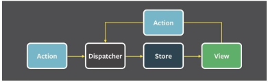

# Flux
Flux is an application design paradigm used as a replacement for the more traditional MVC pattern. It is not a framework
or a library but a new kind of architecture that complements React and the concept of Unidirectonal data flow. Facebook
uses this pattern internally when working with React.

The workflow between dispatcher, stores and views components with distinct inputs and outputs as follows:

