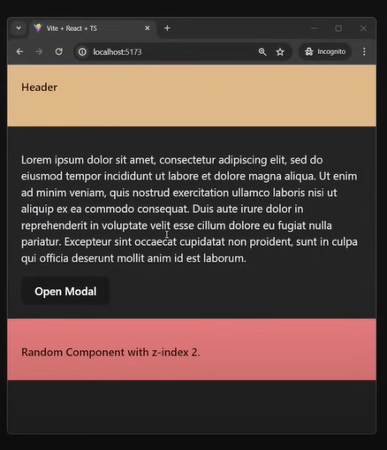
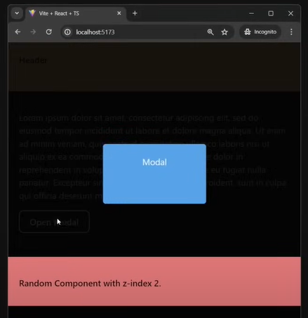

# Understanding z-index and Stacking Contexts in CSS

**Before opening the modal:**
</br>

</br>

**After opening the modal:**
</br>

</br>
## App Structure and z-index Values

- **Header**: `z-index: 1`
- **Content**: `z-index: 1`
  - **Modal with Overlay**: `z-index: 100`
- **Random Component**: `z-index: 2`

## Issue Explanation

Even though the `z-index` of the Modal with Overlay is `100`, it appears below the Random Component. Here’s why:

1. **Sibling Elements in the Same Stacking Context**:
  - **Header**, **Content**, and **Random Component** are all siblings under the parent **App**.
  - They share the same stacking context.

2. **z-index Order in the Same Stacking Context**:
  - In the same stacking context, elements with higher `z-index` values are rendered on top.
  - Thus, the **Random Component** (`z-index: 2`) will be on top of both **Header** and **Content** (`z-index: 1`).

3. **Child Elements Relative to Parent Elements**:
  - The **Modal with Overlay** is a child of **Content**.
  - Regardless of its high `z-index` (`100`), it is confined within the stacking context of **Content**.
  - Since **Content** (`z-index: 1`) is below the **Random Component** (`z-index: 2`), the **Modal with Overlay** will also be rendered below the **Random Component**.

## Summary

- **Header**, **Content**, and **Random Component** are in the same stacking context.
- **Random Component** with `z-index: 2` is on top.
- **Modal with Overlay** is a child of **Content** and is confined to the stacking context of **Content**.
- As a result, **Modal with Overlay** appears below the **Random Component** despite its high `z-index`.

Understanding these rules helps to manage the layering of elements effectively in CSS.

<details>
  <summary>What if there are more element in Modal with Overlay</summary>

### Components and their z-index:

- **App** (Parent container)
  - **Header**: `z-index: 1`
  - **Content**: `z-index: 1`
    - **Element A**: `z-index: 50`
    - **Modal with Overlay**: `z-index: 100`
    - **Element B**: `z-index: 150`
  - **Random Component**: `z-index: 2`

## Stacking Order Explanation

### In the context of the **App**:

1. **Sibling Elements in the Same Stacking Context**:
  - **Header**, **Content**, and **Random Component** are siblings under the parent **App**.
  - They share the same stacking context.
  - The stacking order is determined by their `z-index` values:
    - **Random Component**: `z-index: 2` (On top)
    - **Header** and **Content**: `z-index: 1` (Below Random Component)

### Within the **Content** element:

2. **Elements Inside Content**:
  - **Element A**: `z-index: 50`
  - **Modal with Overlay**: `z-index: 100`
  - **Element B**: `z-index: 150`
  - These elements are within the **Content** stacking context.

### Combined Stacking Order:

- **Random Component** (z-index: 2) is on top within the **App** stacking context.
- **Header** and **Content** are below the **Random Component**.
- Inside **Content**, the stacking order of its children is:
  - **Element B**: `z-index: 150` (On top within Content)
  - **Modal with Overlay**: `z-index: 100` (Below Element B within Content)
  - **Element A**: `z-index: 50` (Below Modal within Content)

### Overall Stacking Order:

1. **Element B** (`z-index: 150` within **Content**) - Highest within **Content**
2. **Modal with Overlay** (`z-index: 100` within **Content**)
3. **Element A** (`z-index: 50` within **Content**)
4. **Random Component** (`z-index: 2`) - Highest within **App**, above **Content** and **Header**
5. **Header** (`z-index: 1`)
6. **Content** (`z-index: 1`)

## Summary

- **Random Component** (`z-index: 2`) is rendered above **Header** and **Content** within the **App**.
- Within **Content**, **Element B** (`z-index: 150`) is on top, followed by **Modal with Overlay** (`z-index: 100`), and then **Element A** (`z-index: 50`).
- The **Random Component** will overlay **Content** and its children, while **Content**'s children respect their own stacking context.
</details>


# Problem's with local modals
* Duplicating the modal code `ConfirmationModal` in multiple components
* Duplicating `isOpen` and `setIsOpen` state in multiple components
* In this case three different copies of `ConfirmationModal` are in Virtual DOM at once, they will be use precious CPU
  cycle every time React rerenders the components.
### Scenario
- App
  - PageA
    - **ConfirmationModal**
  - PageB
    - Component2
      - **ConfirmationModal**
    - Component3
  - PageC
    - Component4
      - **ConfirmationModal**

## Code for `PageA` with Modal

```jsx
const PageA = () => {
  const [isOpen, setIsOpen] = React.useState(false);
  
  return (
    <div>
      {/* ... Page A JSX ... */}
      <ConfirmationModal
        isOpen={isOpen}
        onClose={() => setIsOpen(false)}
      />
      <button onClick={() => setIsOpen(true)}>
        Open Modal
      </button>
    </div>
  );
};
```

## Code for `Component2` with Modal
```jsx
const Component2 = () => {
  const [isOpen, setIsOpen] = React.useState(false);
  
  return (
    <div>
      {/* ... Component 2 JSX ... */}
      <ConfirmationModal
        isOpen={isOpen}
        onClose={() => setIsOpen(false)}
      />
      <button onClick={() => setIsOpen(true)}>
        Open Modal
      </button>
    </div>
  );
};
```

## Code for `Component4` with Modal
```jsx
const Component4 = () => {
  const [isOpen, setIsOpen] = React.useState(false);
  
  return (
    <div>
      {/* ... Component 4 JSX ... */}
      <ConfirmationModal
        isOpen={isOpen}
        onClose={() => setIsOpen(false)}
      />
      <button onClick={() => setIsOpen(true)}>
        Open Modal
      </button>
    </div>
  );
};
```

**Till now it's look like global modal solves all the problem**

| Global Modal                                 | Local Modals                            |
|----------------------------------------------|-----------------------------------------|
| single JSX declaration                       | duplicated JSX declarations             |
| global state declared once                   | duplicated state declarations           |
| single Component instance in the virtual DOM | duplicated component instances in the virtual DOM |

# Global Modal

## Bad implementation of global modal

### All in one Modal Component
This take some props and render the modal based on the dynamic props but it is not a good idea to have all the modals in one component.
As complexity grows it will be hard to maintain and understand the code.
```jsx
const GlobalModal = ({
    headerText,
    contentText,
    numberOfButtons,
}) => {
    return (
        <div>
            <div id="header">{headerText}</div>
            <div id="content">{contentText}</div>
            <div id="footer">
                {numberOfButtons === 1 ? (
                    <button>OK</button>
                ) : (
                    <>
                        <button>OK</button>
                        <button>Cancel</button>
                    </>
                )}
            </div>
        </div>
    );
};
```
### Slighly better implementation
With huge switch case statement, it is better than the previous implementation as it separates the modals but still 
it is not a good idea to have all the modals in one component.
```jsx
import Modal1 from './Modal1';
import Modal2 from './Modal2';
/* ...You get the idea */
import Modal10 from './Modal10';

const GlobalModal = ({ modalName }) => {
    let modalComponent;

    switch (modalName) {
        case 'Modal1':
            modalComponent = <Modal1 />;
            break;
        case 'Modal2':
            modalComponent = <Modal2 />;
            break;
        /* ...You get the idea */
        case 'Modal10':
            modalComponent = <Modal10 />;
            break;
        default:
            modalComponent = null;
            break;
    }

    return modalComponent;
};
```

## Better implementation of global modal

In this implementation we have a single global modal component that is rendered in the root of the application using 
global state. And we are passing the setter at the every child component that wants to show the modal.

Inspirited from [@ebay/nice-modal-react](https://www.npmjs.com/package/@ebay/nice-modal-react)

```jsx
// Provider Definition
return (
    <NiceModalContext.Provider value={[reducerState, reducerDispatcher]}>
        {children}
        <NiceModalPlaceholder /> {/* <---- global modal Renderer */}
    </NiceModalContext.Provider>
);

// Renderer Definition
export const NiceModalPlaceholder = () => {
    const [modal, modalId, modalProps] = useContext(NiceModalContext);
    return <modal key={modalId} id={modalId} {...modalProps} />;
};

// dictionary-like Modal Registry
const MODAL_REGISTRY: {
    [id]: { modalComponent, props };
};

export function register(id, modalComponent, props) {
    MODAL_REGISTRY[id] = { modalComponent, props };
}

// reducer actions exposed as functions
export function show(id) { dispatch(showModal(modalId, args)) }
export function hide() { dispatch(hideModal(modalId, args)) }
```
<details>
<summary>Explanation of the implementation</summary>

It's defines a provider to wrap the root component,
```jsx
return (
    <NiceModalContext.Provider value={[reducerState, reducerDispatcher]}>
        {children}
        <NiceModalPlaceholder /> {/* <---- global modal Renderer */}
    </NiceModalContext.Provider>
);
```
it connects with high level reducer which keeps our global modal state `value={[reducerState, reducerDispatcher]}`.
It also takes care of mounting a modal placeholder inside that provider `<NiceModalPlaceholder />` 

This placeholder is extracting one modal component from the global state/props and render it.
```jsx
export const NiceModalPlaceholder = () => {
    const [modal, modalId, modalProps] = useContext(NiceModalContext);
    return <modal key={modalId} id={modalId} {...modalProps} />;
};
```
Modal components still have to be kept in some global registry for a reference but we can define global variable to store
them
```jsx
const MODAL_REGISTRY: {
  [id]: { modalComponent, props };
};
```
and expose a function to register them and expose register function so we can extract all the modal imports and registration
to a separate file.
```jsx
export function register(id, modalComponent, props) {
    MODAL_REGISTRY[id] = { modalComponent, props };
}
```
Lastly we can expose some show and hide the functions to show and hide the modals which are wrappers around the reducer
reducer actions. They will be passed via the context to the individual child components that want to call the global modal.

```jsx
export function show(id) { dispatch(showModal(modalId, args)) }
export function hide() { dispatch(hideModal(modalId, args)) }
```
---------
</details>

### How can we invoke the modal
**With Registry**

Defining global registry file where we can register all the modals and their id and component `NiceModal.register('alertModal', AlertModal);`.
Then we can call the modal with the id `NiceModal.show('alertModal', { title: 'Are you sure?' });`.

### `modalRegister.js`
```jsx
import { AlertModal } from './AlertModal';
import { InfoModal } from './InfoModal';
import { WarningModal } from './WarningModal';
import { ErrorModal } from './ErrorModal';

NiceModal.register('alertModal', AlertModal);
NiceModal.register('infoModal', InfoModal);
NiceModal.register('warningModal', WarningModal);
NiceModal.register('errorModal', ErrorModal);
```
### Usage Example
```jsx
const NestedComponent = () => {
  const someEventHandler = () => {
    NiceModal.show('alertModal', { title: 'Are you sure?' });
  };

  return (
    <div>
      {/* Components JSX */}
      <button onClick={someEventHandler}>Show Alert Modal</button>
    </div>
  );
};
```

### Without Registry
Import custom modal component and show it directly without registering it in the global registry. And passing the component
directly to the `NiceModal.show` function.

```jsx
// no global registry

import { AlertModal } from './AlertModal';

const NestedComponent = () => {
  const someEventHandler = () => {
    NiceModal.show(
      <AlertModal />,
      { title: 'Are you sure?' }
    );
  };

  return (
    <div>
      {/* Components JSX */}
      <button onClick={someEventHandler}>Show Alert Modal</button>
    </div>
  );
};
```

## Global Modal Example vs Local Modal Example

### Global Modal Example

- **Structure:**
  - **root (App)**
    - Global Modal
    - Clipping Container
      - Button

- **Flow:**
  - The `isOpen` state is managed at the root (App) level.
  - Opening the modal causes a global re-render of the root (App) and all its children.
  - Passing data up from the Button to the Global Modal can be complex (prop-drilling).

### Local Modal Example

- **Structure:**
  - **root (App)**
    - Other Component
    - Clipping Container
      - Button
      - Local Modal

- **Flow:**
  - The `isOpen` state is managed locally within the Clipping Container.
  - Opening the modal causes only a local re-render of the Clipping Container and its children.
  - Data handling is simpler and localized, avoiding prop-drilling.


### Global Modal vs Local Modals

| Global Modal                              | Local Modals                                  |
|-------------------------------------------|-----------------------------------------------|
| **single JSX declaration**                | duplicated JSX declarations                   |
| **global state declared once**            | duplicated state declarations                 |
| **single Component instance in the virtual DOM** | duplicated component instances in the virtual DOM    |
| prop-drilling / need for Context          | **no prop-drilling, no need for context**     |
| artificial Modal IDs                      | **no need for IDs**                           |
| increased coupling                        | **no coupling, modals isolated locally**      |
| additional complexity                     | **simplicity**                                |
| re-rendering entire virtual DOM Tree             | **re-rendering only local part of virtual DOM Tree** |
| no access to local Context                | **access to local Context**                   |

## Make local modal better

- Reducing duplicated JSX declarations
  - We can made one Modal wrapper which will handle common functionality like clicking outside of modal, using portal API etc.
  And then make different modal for different type of modal like `AlertModal`, `ConfirmModal`, `PromptModal` etc. By doing 
  this we can maintain dry code and also we can easily manage the modal state and props.
- Removing duplicated State Declarations
  - Also can move state declaration to the wrapper component and pass the state and setter to the child component like this 
  example from Kent C. Dodds </br>
  
    **Declaration**
    ```jsx
    const ModalContext = React.createContext();

    function Modal(props) {
      const [isOpen, setIsOpen] = React.useState(false);
  
      return (
        <ModalContext.Provider value={[isOpen, setIsOpen]} {...props} />
      );
    }
  
    function ModalOpenButton({ children: child }) {
      const [ , setIsOpen] = React.useContext(ModalContext);
  
      return React.cloneElement(child, {
        onClick: callAll(() => setIsOpen(true), child.props.onClick),
      });
    }
  
    function ModalContentsBase(props) {
      const [isOpen, setIsOpen] = React.useContext(ModalContext);
  
      return (
        <Dialog isOpen={isOpen} onDismiss={() => setIsOpen(false)} {...props} />
      );
    }
    ```
    **Usage**
       ```jsx
       <Modal>
          <ModalOpenButton>
              <Button variant="primary">Login</Button>
          </ModalOpenButton>
          <ModalContents aria-label="Login form" title="Login">
              <LoginForm
                onSubmit={login}
                submitButton={<Button variant="primary">Login</Button>}
              />
          </ModalContents>
        </Modal>
      ```
- Removing duplicated Component Instances in the Virtual DOM
  </br>
  We can remove this by using the conditional rendering.
  ```jsx
  return (
    <>
      {isOpen && (
         <ModalComponent {...props} />
      )}
    </>
  )
  ```
 **So till now we can use local modal instant of global modal**

### When to use Global Modal
* When the modal is used across the application(see the diagram below)
* It doesn't have any local context
* Need's to preserve the state of the modal between re-renders
* **Only for very complex case with multiple models which are kept mounted at all times it actually make sence mount it
  globally.**

**Random App Tree**
- App
  - PageA
    - Component1
      - Component8
  - PageB
    - Component2
      - Component5
        - Component6
        - InfoModal
        - Component7
          - InfoModal
    - Component3 (isOpen)
      - InfoModal
  - PageC
    - Component4 (Local Context)
      - Component5
      - Component5

But still those case can use local modal as we can get the lowest common ancestor of the components that need the modal
and put the modal there(in this case it is `PageB`) and it's all children can use the modal.(But I will not use local modal
in this case as it will be hard to manage the state of the modal)

### Structure of app
- App
  - PageA (Local InfoModal Context)
    - Component1
      - Component8
  - PageB(isOpen) (Local InfoModal Context)
    - Component2
      - Component5(openModal())
        - Component6
        - Component7
    - Component3 (openModal())
    - InfoModal
  - PageC
    - Component4 (Local Context)
      - Component5
      - Component5


# Sources
* [Why 95% of Modals should be Local (in React)](https://www.youtube.com/watch?v=iMoAviG_ZUE)