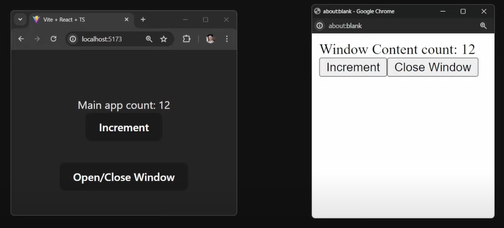

`createPortal` lets us render some children into a different part of the DOM node like at `document.body` or `document.getElementById('some-id')`.
It helps a lot to escape from the parent div's css properties like `overflow: hidden` or `z-index` or `position: relative` or `position: absolute`

In this example we put border around the parent div and the two parent paragraph's placed in the parent div. But border 
only applied with the parent div which is placed normally but for the second paragraph which is placed using 
`createPortal`at `document.body` doesn't have border. So it is rendering outside of MyComponent's DOM node.
</br>


```jsx
import { createPortal } from 'react-dom';

export default function MyComponent() {
  return (
    <div style={{ border: '2px solid black' }}>
      <p>This child is placed in the parent div.</p>
      {createPortal(
        <p>This child is placed in the document body.</p>,
        document.body
      )}
    </div>
  );
}
```

Which is useful if you want to render a modal or a tooltip or a dropdown menu or a context menu or a notification as if 
it's parent have some css properties like `overflow: hidden` or `z-index` or `position: relative` or `position: absolute`
that will break the layout for that our child(like modal, tooltip, dropdown menu, context menu, notification). We can use
portal to escape from that parent div and render it at `document.body` or `document.getElementById('some-id')`.

<details>
    <summary>App.js</summary>

```jsx
export default function ModalContent({ onClose }) {
  return (
    <div className="modal">
      <div>I'm a modal dialog</div>
      <button onClick={onClose}>Close</button>
    </div>
  );
}
```
</details>

<details>
    <summary>ModalContent.js</summary>

```jsx
export default function ModalContent({ onClose }) {
    return (
        <div className="modal">
            <div>I'm a modal dialog</div>
            <button onClick={onClose}>Close</button>
        </div>
    );
}
```
</details>

<details>
    <summary>index.js</summary>

```jsx
import React, { StrictMode } from "react";
import { createRoot } from "react-dom/client";
import "./styles.css";

import App from "./App";

const root = createRoot(document.getElementById("root"));
root.render(
    <StrictMode>
        <App />
    </StrictMode>
);
```
</details>

<details>
    <summary>styles.css</summary>

```css
* {
    box-sizing: border-box;
}

body {
    font-family: sans-serif;
    margin: 20px;
    padding: 0;
}

h1 {
    margin-top: 0;
    font-size: 22px;
}

h2 {
    margin-top: 0;
    font-size: 20px;
}

h3 {
    margin-top: 0;
    font-size: 18px;
}

h4 {
    margin-top: 0;
    font-size: 16px;
}

h5 {
    margin-top: 0;
    font-size: 14px;
}

h6 {
    margin-top: 0;
    font-size: 12px;
}

code {
    font-size: 1.2em;
}

ul {
    padding-inline-start: 20px;
}

.clipping-container {
    position: relative;
    border: 1px solid #aaa;
    margin-bottom: 12px;
    padding: 12px;
    width: 250px;
    height: 80px;
    overflow: hidden;
}

.modal {
    display: flex;
    justify-content: space-evenly;
    align-items: center;
    box-shadow: rgba(100, 100, 111, 0.3) 0px 7px 29px 0px;
    background-color: white;
    border: 2px solid rgb(240, 240, 240);
    border-radius: 12px;
    position:  absolute;
    width: 250px;
    top: 70px;
    left: calc(50% - 125px);
    bottom: 70px;
}
```
</details>

**NoPortalExample.js**
```jsx
import { useState } from 'react';
import ModalContent from './ModalContent.js';

export default function NoPortalExample() {
  const [showModal, setShowModal] = useState(false);
  return (
    <>
      <button onClick={() => setShowModal(true)}>
        Show modal without a portal
      </button>
      {showModal && (
        <ModalContent onClose={() => setShowModal(false)} />
      )}
    </>
  );
}
```
**PortalExample.js**
```jsx
import { useState } from 'react';
import { createPortal } from 'react-dom';
import ModalContent from './ModalContent.js';

export default function PortalExample() {
  const [showModal, setShowModal] = useState(false);
  return (
    <>
      <button onClick={() => setShowModal(true)}>
        Show modal using a portal
      </button>
      {showModal && createPortal(
        <ModalContent onClose={() => setShowModal(false)} />,
        document.body
      )}
    </>
  );
}
```

Modal without portal will get cut for `overflow: hidden` at `clipping-container` class. </br>


But as the modal using portal rendering the modal at the `document.body` DOM node not in the regular dom flow.</br>


# Portals Can Share State Between Windows
If we have a count application and we increment the count to 5 and duplicate that tab then the count will be 5 at the first
tab and 0 at the second tab. But if we use `createPortal` to render the count at the `document.body` then the count will
be 5 at both tabs. Because the count is shared between the two tabs. No local storage no cookies no indexedDB no server
communication.

### `App.js`

```jsx
import React, { useState } from 'react';
import NewWindow from 'react-new-window';

function App() {
  const [count, setCount] = useState(0);
  const [isWindowOpen, setIsWindowOpen] = useState(false);

  const toggleWindow = () => {
    setIsWindowOpen(isWindowOpen => !isWindowOpen);
  };

  return (
    <>
      <div className="card">
        <div>Main app count: {count}</div>
        <button onClick={() => setCount(count => count + 1)}>
          Increment
        </button>
      </div>
      <button onClick={toggleWindow}>Open/Close Window</button>
      {isWindowOpen && (
        <NewWindow>
          <div>Window Content count: {count}</div>
          <button onClick={() => setCount(count => count + 1)}>
            Increment
          </button>
          <button onClick={() => setIsWindowOpen(false)}>
            Close Window
          </button>
        </NewWindow>
      )}
    </>
  );
}

export default App;
```
### `NewWindow.tsx`
```jsx
import React, { useRef, useEffect } from 'react';
import { createPortal } from 'react-dom';

export function NewWindow({ children }: React.PropsWithChildren<{}>) {
  const containerRef = useRef<HTMLDivElement>(document.createElement('div'));
  const windowRef = useRef<Window | null>(null);

  useEffect(() => {
    windowRef.current = window.open(
      "",
      "",
      "width=400,height=400,left=800,top=400"
    );
    windowRef.current?.document.body.appendChild(containerRef.current);
    return () => {
      windowRef.current?.close();
    };
  }, []);

  return createPortal(children, containerRef.current);
}
```
Main tab on the left and new tab on the right(this opened on click `Open/Close Window` button). </br>

This print count value and set count value in main tab
```jsx
<div className="card">
    <div>Main app count: {count}</div>
    <button onClick={() => setCount(count => count + 1)}>
      Increment
    </button>
</div>
```
This will print count value and set count value in new tab on click `Open/Close Window` button
```jsx
<NewWindow>
  <div>Window Content count: {count}</div>
  <button onClick={() => setCount(count => count + 1)}>
    Increment
  </button>
  <button onClick={() => setIsWindowOpen(false)}>
    Close Window
  </button>
</NewWindow>
```
And both of them will share the same count value. So if we increment the count in the main tab then the count will be
incremented in the new tab as well. And if we increment the count in the new tab then the count will be incremented in the
main tab as well. Because the count is shared between the two tabs. 

In `NewWindow.js` first we create new single div element and store it in `containerRef` using `useRef` hook 
`const containerRef = useRef<HTMLDivElement>(document.createElement('div'));` This act as a container for the `children`
passed to the `NewWindow` component from the `App` component. `createPortal` function create portal runs for the first time
on initial render before `useEffect` hook runs. On the first go, we instruct react to render the `children` into to 
a container that is created but not appended to any DOM tree. And react doesn't care and it will render children to this
container just fine.

Now new window access a regular component in `App.tsx` and render it in a new window. So whenever state changes it will 
rerender new window component and update the count value in the new window. **But this has a issue if we close the first
window app will crash because root component was unmounted**

For better implementation we have some packages [react-new-window](https://www.npmjs.com/package/react-new-window), 
[react-new-improved-window](https://www.npmjs.com/package/react-new-improved-window), [rc-new-window](https://www.npmjs.com/package/rc-new-window)

We just used vanila javascript to open a new window and append the container DOM to the new window's body. This is not react
specific.

Portal let us to split the rendering to two completely separate target in the real DOM even in two separate DOM. Portal 
does not care if the target container is in the another DOM or in the same DOM or in the same DOM but in a different part or 
in the separate window. Also it does not care is the container already mounted or not.  It just render the children to the target container.
React can keep those rendered components under single virtual DOM maintaining their hierachical structure and their state

Consequences of keeping components in single virtual DOM

- Keeping synchronized state between the two windows
- Passing context down to the tree
- Bubbling events up the tree
- Error boundaries working across the tree
- Suspense working across the tree

## When to use Portals
- Whenever want to allow users to take slice of UI and render it in separate window(we can synchronize browser memory 
  but that is expansive)
- Print certificates or invoices
- DevTools react query devtools already using portal to render the query devtools in a separate window
- Picture-in-Picture API
- Dialog, global message notification, hover cards, tooltips, dropdowns, context menus, modals, popovers, popups, 
  notifications, and so on

**One limitation of this technics**
- We can only portal to the windows that we expicitly open from our code using `window.open()`. This is security aspect 
  of browser. If we do not save the reference to the window object that we open then we can't portal to that window.
- We can't portal to the windows or tabs that are already opened by the user or by the browser itself.

### Sources
- [Senior-Level Understanding of React Portals](https://www.youtube.com/watch?v=5F7GrlIPdJ4)
- [Portals Can Share State Between Windows](https://www.youtube.com/watch?v=jZx33FPMXzc)
- [createPortal - React DOC](https://react.dev/reference/react-dom/createPortal)