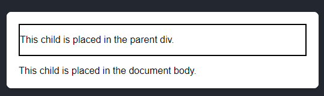
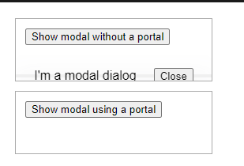
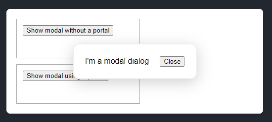

`createPortal` lets us render some children into a different part of the DOM node like at `document.body` or `document.getElementById('some-id')`.

In this example we put border around the parent div and the two parent paragraph's placed in the parent div. But border 
only applied with the parent div which is placed normaly but for the second paragraph which is placed using `createPortal`
at `document.body` doesn't have border. So it is rendering outside of MyComponent's DOM node.
</br>



```jsx
import { createPortal } from 'react-dom';

export default function MyComponent() {
  return (
    <div style={{ border: '2px solid black' }}>
      <p>This child is placed in the parent div.</p>
      {createPortal(
        <p>This child is placed in the document body.</p>,
        document.body
      )}
    </div>
  );
}
```

Which is useful if you want to render a modal or a tooltip or a dropdown menu or a context menu or a notification as if 
it's parent have some css properties like `overflow: hidden` or `z-index` or `position: relative` or `position: absolute`
that will break the layout for that our child(like modal, tooltip, dropdown menu, context menu, notification). We can use
portal to escape from that parent div and render it at `document.body` or `document.getElementById('some-id')`.

<details>
    <summary>App.js</summary>

```jsx
export default function ModalContent({ onClose }) {
  return (
    <div className="modal">
      <div>I'm a modal dialog</div>
      <button onClick={onClose}>Close</button>
    </div>
  );
}
```
</details>

<details>
    <summary>ModalContent.js</summary>

```jsx
export default function ModalContent({ onClose }) {
    return (
        <div className="modal">
            <div>I'm a modal dialog</div>
            <button onClick={onClose}>Close</button>
        </div>
    );
}
```
</details>

<details>
    <summary>index.js</summary>

```jsx
import React, { StrictMode } from "react";
import { createRoot } from "react-dom/client";
import "./styles.css";

import App from "./App";

const root = createRoot(document.getElementById("root"));
root.render(
    <StrictMode>
        <App />
    </StrictMode>
);
```
</details>

<details>
    <summary>styles.css</summary>

```css
* {
    box-sizing: border-box;
}

body {
    font-family: sans-serif;
    margin: 20px;
    padding: 0;
}

h1 {
    margin-top: 0;
    font-size: 22px;
}

h2 {
    margin-top: 0;
    font-size: 20px;
}

h3 {
    margin-top: 0;
    font-size: 18px;
}

h4 {
    margin-top: 0;
    font-size: 16px;
}

h5 {
    margin-top: 0;
    font-size: 14px;
}

h6 {
    margin-top: 0;
    font-size: 12px;
}

code {
    font-size: 1.2em;
}

ul {
    padding-inline-start: 20px;
}

.clipping-container {
    position: relative;
    border: 1px solid #aaa;
    margin-bottom: 12px;
    padding: 12px;
    width: 250px;
    height: 80px;
    overflow: hidden;
}

.modal {
    display: flex;
    justify-content: space-evenly;
    align-items: center;
    box-shadow: rgba(100, 100, 111, 0.3) 0px 7px 29px 0px;
    background-color: white;
    border: 2px solid rgb(240, 240, 240);
    border-radius: 12px;
    position:  absolute;
    width: 250px;
    top: 70px;
    left: calc(50% - 125px);
    bottom: 70px;
}
```
</details>

**NoPortalExample.js**
```jsx
import { useState } from 'react';
import ModalContent from './ModalContent.js';

export default function NoPortalExample() {
  const [showModal, setShowModal] = useState(false);
  return (
    <>
      <button onClick={() => setShowModal(true)}>
        Show modal without a portal
      </button>
      {showModal && (
        <ModalContent onClose={() => setShowModal(false)} />
      )}
    </>
  );
}
```
**PortalExample.js**
```jsx
import { useState } from 'react';
import { createPortal } from 'react-dom';
import ModalContent from './ModalContent.js';

export default function PortalExample() {
  const [showModal, setShowModal] = useState(false);
  return (
    <>
      <button onClick={() => setShowModal(true)}>
        Show modal using a portal
      </button>
      {showModal && createPortal(
        <ModalContent onClose={() => setShowModal(false)} />,
        document.body
      )}
    </>
  );
}
```

Modal without portal will get cut for `overflow: hidden` at `clipping-container` class. </br>


But as the modal using portal rendering the modal at the `document.body` DOM node not in the regular dom flow.</br>


### Sources
- [Senior-Level Understanding of React Portals](https://www.youtube.com/watch?v=5F7GrlIPdJ4)
- [createPortal - React DOC](https://react.dev/reference/react-dom/createPortal)