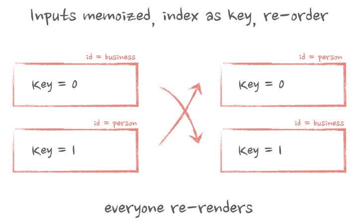
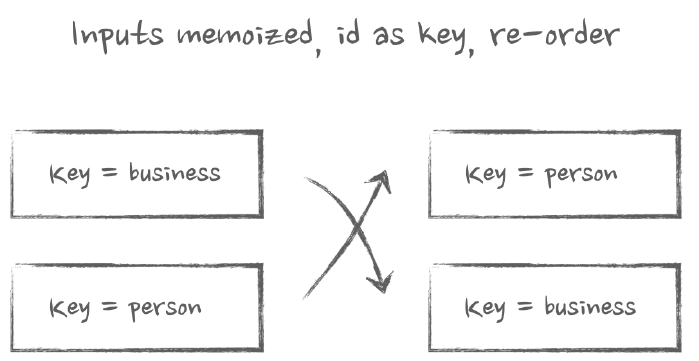
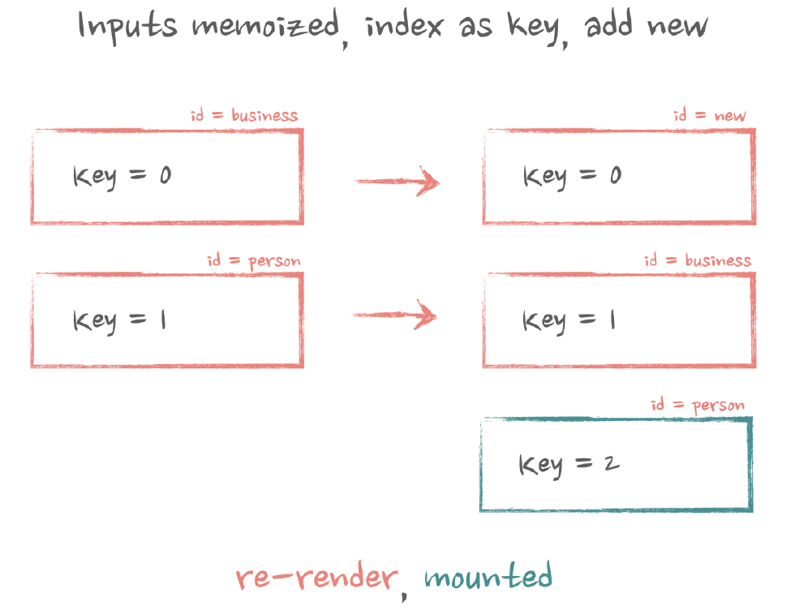
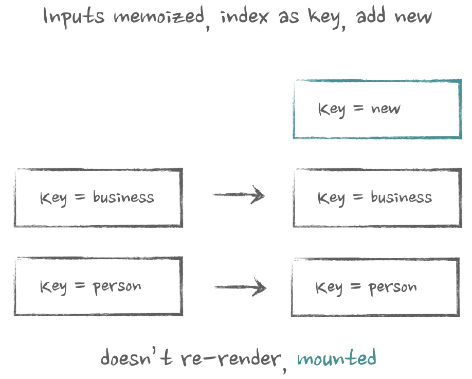

# `props`
- **Props are inputs to components.**
- `props` are the first argument to the function component.
- `props` is short for properties.
- `props` are immutable.
- `props` are passed from parent to child component.

### `App.js`
```jsx
import React from 'react';
import ReactDOM from 'react-dom';
import WarningDialog from './WarningDialog';
import InfoDialog from './InfoDialog';
import ErrorDialog from './ErrorDialog';

const App = () => {
  return (
    <div>
      <WarningDialog title="Warning" message="This is a warning message." />
      <InfoDialog title="Info" message="This is an informational message." />
      <ErrorDialog title="Error" message="This is an error message." />
    </div>
  );
};

ReactDOM.render(<App />, document.getElementById('root'));
```
```js
import React from 'react';

const WarningDialog = ({ title, message }) => {
  const dialogStyle = { 
    border: '1px solid orange', 
    backgroundColor: '#fff3cd', 
    color: '#856404', 
    padding: '20px', 
    borderRadius: '5px', 
    margin: '10px 0' 
  };

  return (
    <div style={dialogStyle}>
      <h2>{title}</h2>
      <p>{message}</p>
    </div>
  );
};

export default WarningDialog;
```
```js
import React from 'react';

const InfoDialog = ({ title, message }) => {
  const dialogStyle = { 
    border: '1px solid blue', 
    backgroundColor: '#cce5ff', 
    color: '#004085', 
    padding: '20px', 
    borderRadius: '5px', 
    margin: '10px 0' 
  };

  return (
    <div style={dialogStyle}>
      <h2>{title}</h2>
      <p>{message}</p>
    </div>
  );
};

export default InfoDialog;
```
```js
import React from 'react';

const ErrorDialog = ({ title, message }) => {
  const dialogStyle = { 
    border: '1px solid red', 
    backgroundColor: '#f8d7da', 
    color: '#721c24', 
    padding: '20px', 
    borderRadius: '5px', 
    margin: '10px 0' 
  };

  return (
    <div style={dialogStyle}>
      <h2>{title}</h2>
      <p>{message}</p>
    </div>
  );
};

export default ErrorDialog;
```

### Default props for reducing redundancy and prop passing
We can add default props to the `Button` component to reduce redundancy and prop passing. Also, can override the default 
props when needed.

```tsx
import React, { ReactElement } from 'react';

import LoadingIcon from '@mui/icons-material/HourglassEmpty';
import './styles.scss';

type IconProps = {
  color?: string;
  size?: 'large' | 'medium' | 'small';
};
const Loading = ({ color, size }: IconProps) => <LoadingIcon style={{ color }} fontSize={size} />;

type ButtonProps = {
  icon: ReactElement;
  size?: 'large' | 'normal';
  appearance?: 'primary' | 'secondary';
};

const Button = ({ icon, size = 'normal', appearance = 'primary' }: ButtonProps) => {
  // create default props
  const defaultIconProps = {
    size: size === 'large' ? 'large' : 'medium',
    color: appearance === 'primary' ? 'white' : 'black',
  };
  const newProps = {
    ...defaultIconProps,
    // make sure that props that are coming from the icon override default if they exist
    ...icon.props,
  };

  // clone the icon and assign new props to it
  const clonedIcon = React.cloneElement(icon, newProps);

  return <button className={`button ${appearance}`}>Submit {clonedIcon}</button>;
};

export default function App() {
  return (
    <>
      <h4>primary button will have white icons</h4>
      <Button appearance="primary" icon={<Loading />} />

      <h4>secondary button will have black icons</h4>
      <Button appearance="secondary" icon={<Loading />} />

      <h4>large button will have large icons</h4>
      <Button size="large" icon={<Loading />} />

      <h4>override default icons</h4>
      <Button size="large" icon={<Loading color="red" />} />
    </>
  );
}
```
While this approach works pretty well for simple cases, it is not that
good for something more complicated.


Example in class component:
```jsx
import React from "react";
import ReactDOM from "react-dom";

class ChildComponent extends React.Component {
    render() {
        return (
            <div>
                <p>{this.props.name}</p>
                <p>{this.props.age}</p>
                <p>{this.props.gender}</p>
            </div>
        );
    }
}

class ParentComponent extends React.Component {
    render() {
        return (
            <div>
                <ChildComponent name="John" age="30" gender="male" />
                <ChildComponent name="Mary" age="25" gender="female" />
            </div>
        );
    }
}
```


# `children` prop
The `children` prop is a special prop that is passed a child component into a parent component. The `children` prop is
used to render the child component inside the parent component.

### Example
**Functional Component**

```jsx
function MyDiv({ children }){
  return (
    <div>
      {children}
    </div>
  );
}

export default function Greeting() {
  return (
    <MyDiv>
      <span>{"Hello"}</span>
      <span>{"World"}</span>
    </MyDiv>
  );
}
```

**Class Component**
```jsx
const MyDiv = React.createClass({
  render: function () {
    return <div>{this.props.children}</div>;
  },
});

ReactDOM.render(
  <MyDiv>
    <span>{"Hello"}</span>
    <span>{"World"}</span>
  </MyDiv>,
  node
);
```
There are several methods in legacy React API to work with children props like `React.Children.map`, 
`React.Children.forEach`, `React.Children.count`, `React.Children.toArray`, `React.Children.only` etc.


# `key` prop
The `key` prop is a special attribute that React uses to identify elements in a list. When rendering a list of elements,
React uses the `key` prop to determine which elements have changed, are added, or are removed. The `key` prop should be
unique for each element in the list and should not change over time.

When an element is added to a list, React uses the `key` prop to determine where to insert the new element. When an
element is removed from a list, React uses the `key` prop to identify which element to remove. When an element is
updated in a list, React uses the `key` prop to determine which element has changed.

Common misconceptions about the `key` is it needs for performance. But it is not true. The `key` prop is not used for
performance optimization. It is used to identify elements in a list and determine which elements have changed, are added,
or are removed.

* Using *indexes* for keys is **not recommended** if the order of items may change. This can negatively impact 
  performance and may cause issues with component state.
* If you extract list item as separate component then apply keys on list component instead of `li` tag.
* There will be a warning message in the console if the `key` prop is not present on list items.
* The key attribute accepts either string or number and internally convert it as string type.
* Don't generate the key on the fly something like `key={Math.random()}`. Because the keys will never match up between
  re-renders and DOM created everytime.
* If we don't specify the `key` prop, React will use the index of the array as the key. But it is not recommended.

If we want to stop re-rendering we can use `React.memo`. For static array we can use `React.memo` and for `key` prop we
use some sort of `id` or index as `key` prop.
- If we use `id` as `key` prop, we can use `React.memo` to stop re-rendering.
  ```jsx
    const Form = () => {
        const [inputs, setInputs] = useState([
            { id: 1, placeholder: "Enter your name" },
            { id: 2, placeholder: "Enter your email" },
            { id: 3, placeholder: "Enter your phone number" },
        ]);
    
        return (
            <>
                {inputs.map((input) => (
                    <Input key={input.id} id={input.id} placeholder={input.placeholder} ... />
                ))}
            </>
        )
    }
    
    const Input = React.memo(({ id, placeholder }) => {
        return (
            <input type="text" id={id} placeholder={placeholder} />
        );
    });
  ```
- If we use index as `key` prop, we `React.memo` will not work as expected. Because the index will be changed when the
  array is changed. So, the `key` prop will be changed and the component will be unmounted and mounted again. The state
  will be lost and the input box will be empty
  ```jsx
    const Form = () => {
        const [inputs, setInputs] = useState([
            { id: 1, placeholder: "Enter your name" },
            { id: 2, placeholder: "Enter your email" },
            { id: 3, placeholder: "Enter your phone number" },
        ]);
    
        return (
            <>
                {inputs.map((input, index) => (
                    <Input key={index} id={input.id} placeholder={input.placeholder} ... />
                ))}
            </>
        )
    }

  ```

## Preventing unnecessary re-renders with React.memo
If we want to prevent re-renders of items, we need to use `React.memo` to wrap the component.

In this example, if parent component re-renders, the `InputMemo` component will not re-render if the props are the same.
```jsx
const data = [
    { id: 'business', placeholder: 'Business Tax' },
    { id: 'person', placeholder: 'Person Tax' },
];

const InputMemo = React.memo(Input);
const Component = () => {
    // array's index is fine here, the array is static
    return data.map((value, index) => (
        <InputMemo
            key={index}
            placeholder={value.placeholder}
        />
    ));
};
```

### Swapping elements
But with dynamic array if we sort swap the business and person tax, the `InputMemo` component will re-render. After 
sorting the array with `key=0` and `key=1` are same type and same key but as the props `placeholder` are different for 
first element, it changed from "Business Tax" to "Person Tax" the `InputMemo` component will re-render.
```js
// array before re-render
[
    { id: 'business', placeholder: 'Business Tax' },
    { id: 'person', placeholder: 'Person Tax' },
]
// array after re-render
[
    { id: 'person', placeholder: 'Person Tax' },
    { id: 'business', placeholder: 'Business Tax' },
]
```


source: [Advanced React](https://www.advanced-react.com/)

To fix this issue, we can use `id` as `key` prop. As the `id` is unique for each element, React will not re-render the
component. The `InputMemo` component will not re-render.
```jsx
const data = [
    { id: 'business', placeholder: 'Business Tax' },
    { id: 'person', placeholder: 'Person Tax' },
];

const InputMemo = React.memo(Input);
const Component = () => {
    return data.map((value) => (
        <InputMemo
            key={value.id}
            placeholder={value.placeholder}
        />
    ));
};
```
If the data has nothing unique like an id , then we'd need to iterate over that array somewhere outside of the component
that re-renders and add that id there manually.

In our case of our inputs, if we use the id for key , the item with the key="business" will still have the prop
placeholder="Business Tax" just in a different place in the array. So React will just swap the associated DOM nodes
around, but the actual component won't rerender.



source: [Advanced React](https://www.advanced-react.com/)

### Adding new element at the top
If we were adding another input at the beginning of the array. If we use the array's index as key , then the item with
the key="0" , from React's perspective, will just change its placeholder prop from "Business Tax" to "New tax"; key="1"
item will transition from "Person Tax" to "Business Tax". So they both will re-render. And the new item with the key="2"
and the text "Person Tax" will be mounted from scratch.



source: [Advanced React](https://www.advanced-react.com/)

And if we use the id as a key instead, then both "Business Tax" and "Person Tax" will keep their keys, and since they
are memoized, they won't re-render. And the new item, with the key "New tax", will be mounted from scratch.



source: [Advanced React](https://www.advanced-react.com/)

**This technique is known as "state reset".** It is used to reset the state of the component when the component is 
unmounted and mounted again of an uncontrolled component like input box.


### Using "key" to force reuse of an existing element
In this example component will be re-rendered and will unmount and mount again. The state will be lost and the input box
will be empty.
```jsx
const Form = () => {
    const [isCompany, setIsCompany] = useState(false);
    
    return (
        <>
          <Checkbox onChange={() => setIsCompany(!isCompany)} />
          {isCompany ? <Input id="company-tax-id-number" ... /> : null}
          {!isCompany ? <Input id="person-tax-id-number" ... /> : null}
        </>
    )
}
```
But in this example component will be re-rendered and will not unmount and mount again. The state will be preserved and
the input box will not be empty. Because the `key` prop is same for both components.
```jsx
const Form = () => {
    const [isCompany, setIsCompany] = useState(false);
    
    return (
        <>
          <Checkbox onChange={() => setIsCompany(!isCompany)} />
          {isCompany ? <Input id="company-tax-id-number" key="tax-input" ... /> : null}
          {!isCompany ? <Input id="person-tax-id-number" key="tax-input"... /> : null}
        </>
    )
}
```
Before `isCompany` is `false`
```json
{
  "type": "Input",
  "key": "tax-input",
  "props": {
    "id": "person-tax-id-number"
  }
}
```
After `isCompany` is `true`
```json
{
  "type": "Input",
  "key": "tax-input",
  "props": {
    "id": "company-tax-id-number"
  }
}
```
As the `key` prop is same, React will not unmount and mount the component. React will just re-render the component so
the state will be preserved. The input box will not be empty.

#### Why react force key only for array?
React needs to know which elements have changed, are added, or are removed. When rendering a list of elements, React
uses the `key` prop to determine which elements have changed, are added, or are removed. The `key` prop should be unique 
for each element in the list and should not change over time.

```jsx
const data = ['1', '2'];

const Component = () => {
    return (
        <>
          {data.map((i) => (
              <Input key={i} id={i} />
          ))}
          {/* will this input re-mount if I add a new item in the array above? */}
          <Input id="3" />
        </>
    );
};
```
We can think react will define object like this. So if we add another element then it will with key 3 and react have to
place it after key 2.
```jsx
[
    { type: Input, key: 1 }, // input from the array
    { type: Input, key: 2 }, // input from the array
    { type: Input }, // input after the array
];
```
But this is not the case. First one is the array and the second one is the manual input. So, the manual input will not be
unmounted and mounted again. The state will be preserved and the input box will not be empty.
```js
[
    // the entire dynamic array is the first position in the children's array
    [
        { type: Input, key: 1 },
        { type: Input, key: 1 },
        { type: Input, key: 2 },
    ],
    {
        type: Input, // this is our manual Input after the array
    },
];
```


# Render props
A render prop is a function that returns an Element.

- Render props is a technique for sharing code between React components using a prop whose value is a function.
- The function is called by the component that receives the prop.
- The function returns a React element.
- The function can take arguments.
- The function can return a React element with props also with children.

Sharing state is also not a problem anymore. We can simply merge that state value into the object we're passing to the
icon:

```tsx
import { ReactElement } from 'react';

import Home from '@mui/icons-material/Home';
import './styles.scss';

type IconProps = {
    color: string;
    size?: 'large' | 'medium' | 'small';
};

// This HomeIcon is a render prop
const HomeIcon = ({ color, size }: IconProps) => <Home style={{ color }} fontSize={size} />;

type ButtonProps = {
    renderIcon: (props: IconProps) => ReactElement;
    size?: 'large' | 'normal';
    appearance?: 'primary' | 'secondary';
};

// This Button is a render prop
const Button = ({ appearance = 'primary', size = 'normal', renderIcon }: ButtonProps) => {
    // create default props as before
    const defaultIconProps: IconProps = {
        size: size === 'large' ? 'large' : 'medium',
        color: appearance === 'primary' ? 'white' : 'black',
    };

    // and just pass them to the function
    return <button className={`button ${appearance}`}>Submit {renderIcon(defaultIconProps)}</button>;
};

export default function App() {
    return (
        <>
            <h4>Pass all icon default props</h4>
            <Button renderIcon={(props) => <HomeIcon {...props} />} />
            
            <h4>Override size</h4>
            <Button renderIcon={(props) => <HomeIcon {...props} size="large" color="red" />} />
            
            <h4>Use the actual MUI icon</h4>
            <Button renderIcon={(props) => <Home fontSize={props.size} style={{ color: props.color }} />} />
        </>
    );
}
```
Another way of implementing it [Chapter 4. Example 2](https://www.advanced-react.com/examples/04/02)

```tsx
import { ReactElement, useState } from 'react';

import Home from '@mui/icons-material/Home';
import HomeOutlined from '@mui/icons-material/HomeOutlined';
import './styles.scss';

type IconProps = {
  color: string;
  size?: 'large' | 'medium' | 'small';
};

type IconState = {
  isHovered: boolean;
};

// This HomeIcon is a render prop
const HomeIcon = ({ color, size }: IconProps) => <Home style={{ color }} fontSize={size} />;
// This HomeOutlinedIcon is a render prop
const HomeOutlinedIcon = ({ color, size }: IconProps) => <HomeOutlined style={{ color }} fontSize={size} />;

type ButtonProps = {
  renderIcon: (props: IconProps, state: IconState) => ReactElement;
  size?: 'large' | 'normal';
  appearance?: 'primary' | 'secondary';
};

const Button = ({ appearance = 'primary', size = 'normal', renderIcon }: ButtonProps) => {
  const [isHovered, setIsHovered] = useState(false);

  // create default props as before
  const defaultIconProps: IconProps = {
    size: size === 'large' ? 'large' : 'medium',
    color: appearance === 'primary' ? 'white' : 'black',
  };

  // and just pass them to the function
  return (
    <button onMouseOver={() => setIsHovered(true)} onMouseOut={() => setIsHovered(false)} className={`button ${appearance}`}>
      Submit {renderIcon(defaultIconProps, { isHovered })}
    </button>
  );
};

export default function App() {
  return (
    <>
      <h4>Change icon's color on button's hover</h4>
      <Button renderIcon={(props, state) => <HomeIcon {...props} color={state.isHovered ? 'red' : 'black'} />} />
      <h4>Change icon on button's hover</h4>
      <Button renderIcon={(props, state) => (state.isHovered ? <HomeOutlinedIcon {...props} /> : <HomeIcon {...props} />)} />
    </>
  );
}
```

## Sharing stateful logic: children as render props
A component that tracks the resize event on the browser window. But in this case both the `ResizeDetector` and the 
component which is using it also it will need another state to store the width of the window.

NOTE: I prefer to use hooks instead of render props. Also, it was used by programmer before hooks were introduced 
in React.

* Render props for configuration and flexibility use cases.
* Before hooks, render props were used to share stateful logic between components

```tsx
const ResizeDetector = ({ onWidthChange }) => {
    const [width, setWidth] = useState();

    useEffect(() => {
        const listener = () => {
            const width = window.innerWidth;
            setWidth(width);
            // trigger onWidthChange prop here
            onWidthChange(width);
    }

    window.addEventListener("resize", listener);
    // the rest of the code
    }, []);
    
    return ...
}
```

If we want to track the window size in different components without duplicating the logic, we needs to pass a state to 
the `ResizeDetector` component but doing that we needs two state for tacking one value.

```jsx
const ResizeDetector = ({ onWidthChange }) => {
    const [width, setWidth] = useState();

    useEffect(() => {
        const listener = () => {
        const width = window.innerWidth;
        setWidth(width);
        // trigger onWidthChange prop here
        onWidthChange(width);
    }
    
    window.addEventListener("resize", listener);
    // the rest of the code
    }, []);
    
    return ...
}
```
```tsx
const Layout = () => {
    const [windowWidth, setWindowWidth] = useState(0);

    return (
        <>
            <ResizeDetector onWindowWidth={setWindowWidth} />
            {windowWidth > 600 ? (
                <WideLayout />
            ) : (
                <NarrowLayout />
            )}
        </>
    );
};
```

We can use the `children` prop to pass the state to the children components. This way we can avoid duplicating the state
in the parent component and the `ResizeDetector` component.

```tsx
import { ReactElement, useEffect, useState } from 'react';
import './styles.scss';

type ResizeDetectorProps = {
  children: (width: number) => ReactElement;
};

const WideLayout = () => <div style={{ background: 'salmon', width: 600, padding: 20 }}>Wide layout</div>;
const NarrowLayout = () => <div style={{ background: 'salmon', width: 300, padding: 20 }}>Narrow layout</div>;

const ResizeDetector = ({ children }: ResizeDetectorProps) => {
  const [width, setWidth] = useState(0);

  useEffect(() => {
    const listener = () => {
      const width = window.innerWidth;
      setWidth(width);
    };

    window.addEventListener('resize', listener);
    // the rest of the code
  }, []);

  // pass width to children
  return children(width);
};

export default function App() {
  return (
    <>
      <h4>Render function for children</h4>
      <ResizeDetector>
        {(windowWidth) => {
          // no more state! Get it directly from the resizer
          return windowWidth > 600 ? <WideLayout /> : <NarrowLayout />;
        }}
      </ResizeDetector>
    </>
  );
}
```

### Replace render props with hooks
Hooks replaced that pattern in almost 99% of cases where it was used.
```js
const useResizeDetector = () => {
    const [width, setWidth] = useState();
    
    useEffect(() => {
        const listener = () => {
        const width = ... // get window width here
        setWidth(width);
    }
    
        window.addEventListener("resize", listener);
        // the rest of the code
    }, [])
    
    return width;
}
```

```jsx
const Layout = () => {
    const windowWidth = useResizeDetector();

    return windowWidth > 600 ? (
        <WideLayout />
    ) : (
        <NarrowLayout />
    );
};
```


# Props validation in react
React provides a way to validate the props that are passed to a component. This is done using the `propTypes` property 
of the component. The `propTypes` property is an object that defines the types of the props that the component expects.

The set of predefined prop types:

* `PropTypes.number`
* `PropTypes.string`
* `PropTypes.array`
* `PropTypes.object`
* `PropTypes.func`
* `PropTypes.node`
* `PropTypes.element`
* `PropTypes.bool`
* `PropTypes.symbol`
* `PropTypes.any`


### Examples
**Class Component**
```jsx
import React from 'react';
import PropTypes from 'prop-types';

class Greeting extends React.Component {
  render() {
    return <h1>Hello, {this.props.name}</h1>;
  }
}

Greeting.propTypes = {
  name: PropTypes.string.isRequired
};

export default Greeting;
```

**Functional Component**
```jsx
import React from 'react';
import PropTypes from 'prop-types';

const Greeting = ({ name }) => <h1>Hello, {name}</h1>;

Greeting.propTypes = {
  name: PropTypes.string.isRequired
};
  
export default Greeting;
```

## Prototype validation with `shape`
If we pass an array of object to a component, we can use `React.PropTypes.shape()` and `React.PropTypes.arrayOf()` to
validate the props.

```jsx
ReactComponent.propTypes = {
  arrayWithShape: React.PropTypes.arrayOf(
    React.PropTypes.shape({
      color: React.PropTypes.string.isRequired,
      fontSize: React.PropTypes.number.isRequired,
    })
  ).isRequired,
};
```


### References:
* [Advanced React](https://www.advanced-react.com/)
* [reactjs-interview-questions - github](https://github.com/sudheerj/reactjs-interview-questions?tab=readme-ov-file#what-is-react)