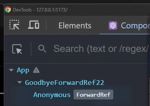
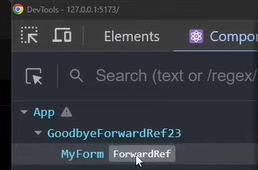
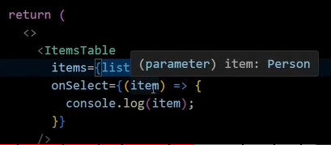
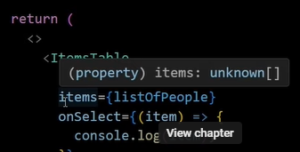
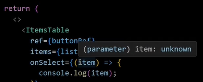

# HTML Element
We can use `useRef` hook to attach ref to the DOM element. So `inputRef.current` will have all
the properties of the html input element.
```jsx
import { useRef, useEffect } from "react";

function RefAttaching() {
    const inputRef = useRef(null);

    useEffect(() => {
        // console.dir - DOM-level view of the object
        console.dir(inputRef.current); // ➡️
        inputRef.current.focus();
    }, []);

    return <input ref={inputRef} />;
}

export default RefAttaching;
```

# Class Component
In class component useRef will attach the ref to the instance of the class. So `inputRef.current` will have all the internal
methods and properties of the class. In the below example, `inputRef.current.internalMethod()` will log the message from the
child component.
```jsx
import { useRef, useEffect, Component } from "react";

class ChildComponent extends Component {
    internalMethod() {
        console.log("This console log is coming from the Child!");
    }

    render() {
        return <input />;
    }
}

function RefAttaching() {
    const inputRef = useRef(null);

    useEffect(() => {
        console.log(inputRef.current); 
        inputRef.current.internalMethod();
    }, []);

    return <ChildComponent ref={inputRef} />;
}

export default RefAttaching;
```

# Functional Component
In functional component, we can't attach ref to the functional component directly. We need to use forwardRef to attach ref to the
functional component. And `inputRef.current` always will be `null`.But we can attach ref to the html element inside the functional component as we did in the first example.

For this example we will get an warning `Warning: Function components cannot be given refs. Attempts to access this ref will fail. Did you mean to use React.forwardRef()?`. To fix this warning we need to use forwardRef.
And `null` will be logged in the console.
```jsx
import { useRef, useEffect } from "react";

const FunctionalInput = () => {
    return <input />;
};

function RefAttaching() {
    const inputRef = useRef(null);

    useEffect(() => {
        console.log("inputRef value: ", inputRef.current); // ➡️
    }, []);

    return <FunctionalInput ref={inputRef} />;
}

export default RefAttaching;
```

# ForwardRef

`forwardRef` lets your component expose a DOM node of child component to the parent component using `ref`. It is a
higher-order component that allows you to access the `ref` object of the child component. It is used to pass the ref 
through the component to the DOM node.

To attach ref to the functional component we need to use forwardRef. In the below example, `inputRef.current` will have 
all the properties of the html input element.
```jsx
import { useRef, useEffect, forwardRef } from "react";

const FunctionalInput = forwardRef((props, ref) => {
    return <input ref={ref} />;
});

function RefAttaching() {
    const inputRef = useRef(null);

    useEffect(() => {
        console.log("inputRef value: ", { domNode: inputRef.current }); // ➡️
    }, []);

    return <FunctionalInput ref={inputRef} />;
}

export default RefAttaching;
```

### But it has some problems

<details>
    <summary>1. `forwardRef` does not support multiple refs</summary>

`<MyForm ref={formRef} />` we can not pass multiple refs to the functional component. It will only accept single ref.
```jsx
    import { useRef, forwardRef } from "react";

    const MyForm = forwardRef((props, ref) => {
        // Only single ref support here ⬆️
        return (
            <form>
                <input ref={ref} />
                <input />
            </form>
        );
    });

    function GoodbyeForwardRef(props) {
        const formRef = useRef();

        return (
            <MyForm ref={formRef} /> {/* what if we want to pass 2 refs? */}
        );
    }
    export default GoodbyeForwardRef;
```
But we can pass multiple refs wrapping them in an object. But it is not a good practice.
```jsx
    import { useRef, useEffect, forwardRef } from "react";

    const MyForm = forwardRef((props, ref) => {
        const inputRef1 = useRef();
        const inputRef2 = useRef();
    
        // Merge refs - useEffect
        useEffect(() => {
            ref.current = {
                inputRef1,
                inputRef2,
            };
        }, []);
    
        return (
            <form>
                <input ref={inputRef1} />
                <input ref={inputRef2} />
            </form>
        );
    });
    
    function GoodbyeForwardRef(props) {
        const formRef = useRef();
    
        // formRef now contains inputRef1 and inputRef2
        return (
            <MyForm ref={formRef} />
        );
    }
    
    export default GoodbyeForwardRef;
```

We can also use `useImperativeHandle` to expose only the required methods to the parent component. It's an escape hatch 
to access the instance of the child component. In the below example, `formRef.current` will have only `inputRef1` and 
`inputRef2`.
```jsx
import { useRef, useImperativeHandle, forwardRef } from "react";

const MyForm = forwardRef((props, ref) => {
    const inputRef1 = useRef();
    const inputRef2 = useRef();

    // Merge refs - useImperativeHandle
    useImperativeHandle(
        ref,
        () => ({
            inputRef1,
            inputRef2,
        }),
        []
    );

    return (
        <form>
            <input ref={inputRef1} />
            <input ref={inputRef2} />
        </form>
    );
});

function GoodbyeForwardRef(props) {
    const formRef = useRef();

    // formRef now contains inputRef1 and inputRef2
    return (
        <MyForm ref={formRef} />
    );
}

export default GoodbyeForwardRef;
```
</details>

<details>
    <summary>2. Component name is not displayed in the dev tools</summary>

In the below example, the component name is not displayed in the dev tools. It will be displayed as anonymous. </br>

```jsx
    import { useRef, forwardRef } from "react";
    
    // A component can lose its displayName in DevTools
    const MyForm = forwardRef((props, ref) => {
        return (
            <form>
            <input ref={ref} />
            <input />
        </form>
    );
    });

    function GoodbyeForwardRef(props) {
    const formRef = useRef();
    
        return (
            <MyForm ref={formRef} />
        );
    }
    
    export default GoodbyeForwardRef;
```
We need to pass the name of the function to the forwardRef to display the name in the dev tools. </br>

```jsx
    import { useRef, forwardRef } from "react";
    
    // A component can lose its displayName in DevTools
    // We have to write "MyForm" name twice and it's easy to forget to use named function
    const MyForm = forwardRef(function MyForm(props, ref) {
        return (
            <form>
                <input ref={ref} />
                <input />
            </form>
        );
    });
    
    function GoodbyeForwardRef23(props) {
        const formRef = useRef();
    
        return (
            <MyForm ref={formRef} />
        );
    }
    
    export default GoodbyeForwardRef23;
```
</details>

<details>
    <summary>3. It's actually boilerplate code(a higher-order component)</summary>

We needs to write forwardRef for each level in multi-layer nested components. In this example we needs to pass ref
from `GoodbyeForwardRef` to `MyForm` and then to `MyInput`.
```jsx
    import { useRef, forwardRef } from "react";
    
    // forwardRef API is basically a boilerplate
    // writing "forwardRef" for each level in multi-layer nested components
    const MyInput = forwardRef(function MyInput(props, ref) {
        return <input ref={ref} />;
    });
    
    // here we go again
    const MyForm = forwardRef(function MyForm(props, ref) {
        return (
            <form>
                <MyInput ref={ref} />
                <MyInput />
            </form>
        );
    });
    
    function GoodbyeForwardRef() {
        const formRef = useRef();
    
        return (
            <MyForm ref={formRef} />
        );
    }
    
    export default GoodbyeForwardRef;
```
</details>

<details>
    <summary>4. It could be naming anti-pattern</summary>

Naming of the ref sometime can be tricky which can lead to confusion.

In this example `ref` can we attached with the form itself or the input or the button. But the name of the ref is `formRef` which is misleading.
```jsx
    import { useRef, forwardRef } from "react";
    
    // Bad naming practice
    // MyForm renders:
    // - a form
    // - 2 inputs
    // - submit button
    const MyForm = forwardRef(function MyForm(props, ref) {
        return (
            <form>
                <input />
                <input />
                <button ref={ref} onClick={props.onClick}>Submit</button>
            </form>
        );
    });
    
    function GoodbyeForwardRef() {
        const formRef = useRef(null);
    
        return (
            // name should be buttonRef
            //how we know that this ref is for the button?
            <MyForm ref={formRef} />
        );
    }
    
    export default GoodbyeForwardRef;
```
In typescript we can attach the type of the ref to the forwardRef. In this example we are attaching the type of the ref to the input element.
But there can be multiple input elements in the form. So we in which input element the ref is attached is not clear.
```jsx
    import { useRef, forwardRef } from "react";
    
    // MyForm renders a form with 2 inputs and a submit button
    const MyForm = forwardRef<HTMLInputElement, { onClick?: () => void }>(
        function MyForm(props, ref) {
            return (
                <form>
                    <input ref={ref} />
                    <input />
                    <button onClick={props.onClick}>Submit</button>
                </form>
            );
        }
    );
    
    function GoodbyeForwardRef42() {
        const formRef = useRef<HTMLInputElement>(null);
    
        return (
            // which input element does this ref refer to? If the name is firstInputRef, it would be clear
            <MyForm ref={formRef} />
        );
    }
    
    export default GoodbyeForwardRef42;
```
</details>

<details>
    <summary>5. Complicated typescript types</summary>

In this example we can use person type at GoodbyeForwardRef. And typescript will work at the GoodbyeForwardRef. Also on hover it will show as Person type.

```jsx
    // ⚠️ TypeScript Issues - generics
    function ItemsTable<T>({
        items,
        onSelect,
    }: {
        items: T[];
        onSelect: (item: T) => void;
    }) {
        return (
            <>
                {items.map((item) => {
                    return (
                        <div onClick={() => onSelect(item)}>
                            {JSON.stringify(item)}
                        </div>
                    );
                })}
            </>
        );
    }
    
    type Person = {
        name: string;
        surname: string;
    };
    
    function GoodbyeForwardRef() {
        const listOfPeople: Person[] = [
            {
                name: "John",
                surname: "Doe",
            },
        ];
    
        return (
            <ItemsTable
                items={listOfPeople}
                onSelect={(item) => {
                    console.log(item);
                }}
            />
        );
    }
    
    export default GoodbyeForwardRef;
```
But we use forwardRef then type person will not work on GoodbyeForwardRef. Both items and item will be type unknown.
 

```jsx
    import { useRef, forwardRef } from "react";
    
    // ForwardRef API
    const ItemsTable = forwardRef(function ItemsTable<T>(
        { items, onSelect }: { items: T[]; onSelect: (item: T) => void },
        ref
    ) {
        return (
            <>
                {items.map((item, index) => (
                    <div key={index} onClick={() => onSelect(item)}>
                        {JSON.stringify(item)}
                    </div>
                ))}
            </>
        );
    });
    
    interface Person {
        name: string;
        surname: string;
    }
    
    function GoodbyeForwardRef() {
        const buttonRef = useRef<HTMLButtonElement>(null);
        const listOfPeople: Person[] = [
            {
                name: "John",
                surname: "Doe",
            },
        ];
    
        return (
            <ItemsTable
                ref={buttonRef}
                items={listOfPeople}
                onSelect={(item) => {
                    console.log(item);
                }}
            />
        );
    }
    
    export default GoodbyeForwardRef;
```
Will Add [TypeScript + React: Typing Generic forwardRefs](https://fettblog.eu/typescript-react-generic-forward-refs/) and
here have it's solution.    
</details>
6. Sometime make application slow 

[Potential performance issues with using forwardRef #13456](https://github.com/facebook/react/issues/13456) 

7. Not supported react below 16.3

# Custom Ref instead of forwardRef
We can pass custom pros to child component and attach ref to the child component. Just we can not named the props same 
as reserved words like `ref`, `key`, `children`.
```jsx
const RESERVED_PROPS = {
  key: true,
  ref: true,
  __self: true,
  __source: true,
};
```
Custom props can be passed to the child component and attach ref to the child component. In the below example, `firstInputRef.current` will have all the properties of the html input element.
```jsx
    // Custom Ref Prop Pattern
    
    import { useRef } from "react";
    
    const MyForm = ({ firstInputRef, onClick }) => {
      return (
        <form>
          <input ref={firstInputRef} />
          <input />
          <button onClick={onClick}>Submit</button>
        </form>
      );
    };
    
    function CustomRefPropPattern1() {
      const firstInputRef = useRef(null);
    
      return (
        <MyForm firstInputRef={firstInputRef} />
      );
    }
    
    export default CustomRefPropPattern1;
```
Example in typescript
```jsx
// Custom Ref Prop Pattern - TypeScript version

import { useRef, ElementRef, RefObject } from "react";

const MyForm = ({
  firstInputRef,
  onClick,
}: {
  firstInputRef: RefObject<ElementRef<"input">>;
  onClick?: () => {};
}) => {
  return (
    <form>
      <input ref={firstInputRef} />
      <input />
      <button onClick={onClick}>Submit</button>
    </form>
  );
};

function CustomRefPropPatternTS() {
  const firstInputRef = useRef<ElementRef<"input">>(null);

  return (
    <MyForm firstInputRef={firstInputRef} />
  );
}

export default CustomRefPropPatternTS;
```
Typescript example with multiple passing refs
```jsx
// Custom Ref Prop Pattern - 2 refs

import { useRef, ElementRef, RefObject } from "react";

const MyForm = ({
  firstInputRef,
  buttonRef,
  onClick,
}: {
  firstInputRef: RefObject<ElementRef<"input">>;
  buttonRef: RefObject<ElementRef<"button">>;
  onClick?: () => {};
}) => {
  return (
    <form>
      <input ref={firstInputRef} />
      <input />
      <button ref={buttonRef} onClick={onClick}>
        Submit
      </button>
    </form>
  );
};

function CustomRefPropPatternTS2() {
  const firstInputRef = useRef<ElementRef<"input">>(null);
  const buttonRef = useRef<ElementRef<"button">>(null);

  return (
    <MyForm firstInputRef={firstInputRef} buttonRef={buttonRef} />
  );
}

export default CustomRefPropPatternTS2;
```
**And this approach solve all the 7 problems of forwardRef.**

# When we needs to use forwardRef
When we need to expose exactly the `ref` prop to the parent component because it's a reserve keyword in react. 

we can isolate two very special subcases when we still need forward ref when we are writing single element proxy 
components so very thin layered components that wrap some dump elements to modify it just a little bit those components 
are usually called similarly to the elements they wrap something like primary button which only renders a button element
and adds some default Styles and I set single element to highlight the case when it renders precisely one element 
because three letter ref is in this case fitting we can be sure to what element our ref will be attached.
```jsx
const PrimaryButton = forwardRef((props, ref) => {
    return (
        <button className={styles.primary} ref={ref} />
    )
})
```
The second case is when we want to simulate instance ref pattern from class components say we want to expose some
internal methods of our component and group them all in one ref in class component we can simply write our methods and 
attach ref to our component which will then have the instance of the entire class
```jsx
class ClassComponent extends React.Component {
    internalMethod() {}
    internalMethod() {}
    
    render() {}
}

<ClassComponent ref={refWithMethods} />
```
In class component `<ClassComponent ref={refWithMethods} />` this will work without forwardRef. </br> </br>

But if it's a functional component there is no instance so we have to attach all those methods man to the ref with use 
effect or use imperative handle and in this case it actually makes sense to call it ref without any prefix because it is 
related to the whole component not any particular underlying Dom node so using forward ref is Justified.

```jsx
const FunctionalComponent = forwardRef((props, ref) => {
    const internalMethod1 = () => {}
    const internalMethod2 = () => {}
    
    useEffect(() => {
        ref.current = {
            internalMethod1,
            internalMethod2,
        }
    }, [])
    
    return <div />
})

<FunctionalComponent ref={refWithMethods} />
```
Still it's worth noting that calling those methods outside of the component breaks its encapsulation which is usually a bad
thing and it also implicitly changes our programming style from declarative which is a default in react to imperative you 
should probably use it only for methods that are interacting with parts of the D API that are not managed by react 
and have to be imperative anyway like Focus management or text selection in any other case I think there is no reason to 
use forward API and you can switch to custom ref pattern to get all the benefits that we have described


### Source
* [Goodbye, forwardRef](https://www.youtube.com/watch?v=m4QbeS9BTNU)
* [Advanced React](https://www.advanced-react.com/)

### Will add
* [TypeScript + React: Typing Generic forwardRefs](https://fettblog.eu/typescript-react-generic-forward-refs/)