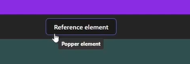

For DOM manipulation, we can use `ref` attribute. But can we assign `setState` to `ref` attribute?

Popper.js is a library that helps you position elements like tooltips and popovers in the DOM. It's a popular library 
that is used in many projects.

This library putting state setter function in `ref` attribute 
`<div ref={setPopperElement} style={styles.popper} {...attributes.popper}>`.

```jsx
import React, { useState } from 'react';
import { usePopper } from 'react-popper';

const Example = () => {
  const [referenceElement, setReferenceElement] = useState(null);
  const [popperElement, setPopperElement] = useState(null);
  const [arrowElement, setArrowElement] = useState(null);
  const { styles, attributes } = usePopper(referenceElement, popperElement, {
    modifiers: [{ name: 'arrow', options: { element: arrowElement } }],
  });

  return (
    <>
      <button type="button" ref={setReferenceElement}>
        Reference element
      </button>
      <div ref={setPopperElement} style={styles.popper} {...attributes.popper}>
        Popper element
        <div ref={setArrowElement} style={styles.arrow} />
      </div>
    </>
  );
};

export default Example;
```
On hover Reference element button, Popper element div will be visible.
Passing setState function to ref attribute is not a good practice. But it's possible as it accepts both `RefObject` and `function`.
`type Ref<T> = RefObject<T> | RefCallback<T> | null;` </br>
`RefCallback: (domNode: Node | null) => void;` </br>
`SetState: (value: any) => void;` </br>
And the setState function will cause re-rendering of the component. So, we are synchronously updating the DOM and causing re-rendering of the component. </br>


```jsx
import React, { useState } from 'react';
import { usePopper } from 'react-popper';

const PopperExample = () => {
  const [isVisible, setIsVisible] = useState(false);
  const [referenceElement, setReferenceElement] = useState(null);
  const [popperElement, setPopperElement] = useState(null);
  const { styles, attributes } = usePopper(referenceElement, popperElement);

  return (
    <div id="wrapper">
      <div id="contentBlock1">Header Mock</div>
      <button
        type="button"
        onMouseEnter={() => setIsVisible(true)}
        onMouseLeave={() => setIsVisible(false)}
        ref={setReferenceElement}
      >
        Reference element
      </button>
      {isVisible && (
        <div id="tooltip" ref={setPopperElement} style={styles.popper} {...attributes.popper}>
          Popper element
        </div>
      )}
    </div>
  );
};

export default PopperExample;
```
**Caveats with callback refs**

If the ref callback is defined as an inline function, it will get called twice during updates, first with null and then
again with the DOM element. This is because a new instance of the function is created with each render, so React needs to
clear the old ref and set up the new one. You can avoid this by defining the ref callback as a bound method on the class,
but note that it shouldn't matter in most cases.

Inline ref callback `setState(abc)` will trigger re-rendering. On each re-render, the inline ref callback is executed 
again because the component is re-evaluated, which calls `setState(abc)` again. This cycle of setting the state, causing 
a re-render, and then setting the state again leads to an infinite loop.
```jsx
import React, { useState } from 'react';

export const PopperExample3 = () => {
  const [state, setState] = useState();

  return (
    <div
      ref={() => {
        setState(abc);
      }}
    />
  );
};
```
But when we are passing dom element to `setState` function, it will not cause re-rendering. Because the `setState` function
is not changing the state of the component. It's just setting the same dom element to the state. So, it's not causing re-rendering.
```jsx
import React, { useState } from 'react';

export const PopperExample = () => {
  const [state, setState] = useState();

  return (
    <div
      ref={(domElement) => {
        setState(domElement);
      }}
    />
  );
};
```

Also, we can verify it using the following code snippet.
```jsx
import { useState, useEffect } from 'react';

export const EffectStateExample = () => {
  const [state, setState] = useState();

  useEffect(() => {
    setState("CONSTANT VALUE");
  }, []);

  return <></>;
};
```
This why `ref={setReferenceElement}` will not cause re-rendering. Because `setReferenceElement` is not changing the 
state of the component. It's just setting the dom element to the state. Unless we remove it conditionally, it will not 
cause re-rendering.


## Rewritten Code with useRef

```javascript
import React, { useState, useRef } from 'react';
import { usePopper } from 'react-popper';

export const PopperExample = () => {
  const [isVisible, setIsVisible] = useState(false);

  const referenceElement = useRef();
  const popperElement = useRef();
  const { styles, attributes } = usePopper(
    referenceElement.current,
    popperElement.current
  );

  return (
    <div id="wrapper">
      <div id="contentBlock1">Header Mock</div>
      <button
        type="button"
        onMouseEnter={() => setIsVisible(true)}
        onMouseLeave={() => setIsVisible(false)}
        ref={referenceElement}
      >
        Reference element
      </button>
      {isVisible && (
        <div
          id="tooltip"
          ref={popperElement}
          style={styles.popper}
          {...attributes.popper}
        >
          Popper element
        </div>
      )}
    </div>
  );
};

export default PopperExample;
```

## Explanation

We remove all state with ref `referenceElement`, `popperElement`. Now on hover no longer positions the tool tip
correctly. To understand what's happening, let's analyze how this code runs step by step starting from the initial
render:

1. **Initial Render**:
    - `useState` for `isVisible` flag is called with the initial value `false`.
    - Define refs for reference and popper elements with `useRef` which are initially `undefined`.
    - `usePopper` hook is called with these undefined values since the elements are not yet attached to the DOM tree.

    ```jsx
    const { styles, attributes } = usePopper(
      referenceElement.current, //=> undefined
      popperElement.current //=> undefined
    );
    ```

2. **Mounting**:
    - JSX in the return statement is parsed and each individual DOM element is then mounted.
    - Refs are attached to the ref attributes `ref={referenceElement}`.
    - After mounting, refs are updated with new values. And the `referenceElement` will be the tooltip dom element.
    - Only the reference element is updated but the tooltip is not rendered yet (since `isVisible` is false).

3. **On Mouse Enter**:
    - Hovering over the reference element triggers the `onMouseEnter` event which sets `isVisible` to `true`.
    - Setting state triggers a new render, now `isVisible` is `true` and refs are read from `useRef` and passed to the 
      `usePopper` hook.
    - But `popperElement` will be still undefined because it is not yet rendered(return statement re-executed yet).

    ```jsx
    const { styles, attributes } = usePopper(
      referenceElement.current, //=> referenceElement DOM node
      popperElement.current //=> undefined
    );
    ```

4. **Rendering Tooltip**:
    - We then go again to the return statement so jsx get parsed this `isVisible` true so `popperElement` get DOM node.
    - The tooltip is rendered and styles from `usePopper` are applied.
    - The styles are incorrect because they are based only on the reference element, and popper element is still 
      `undefined`.
    - After this render, the tooltip's DOM element is attached and the `usePopper` get updated DOM node. We need another
      rerender to update `usePopper` hook.

5. **Final Render**:
    - At this rerender `usePopper` has both `referenceElement`, `popperElement`.
    - The execution stops here but needs another render to correctly calculate styles based on both elements.
    - Updating the `poperElement` does not trigger a new render, unlike `setState` calls.
    - To currently show we need latest `referenceElement` but on change `poperElement` does not trigger any rerender and
      we are left with old `referenceElement` at `usePopper` hook and so wrong css.

Updating ref does not trigger new render as opposed to `setState` calls so we end up in this synchronized state where 
tooltip was rendered but `popper.js` calculated styles based only on reference element(which is old). The lesson is when 
you have a DOM element that you need to use in the rendering code like to pass it to external Library such as 
`popper.js` or read some values from it in render phasce like DOM element measurements that we've seen before in react 
docs.

<details>
<summary>DOM Element managed by React for createPortal() function</summary>

This is an example of how you can dynamically access the DOM Node of an element managed by React, then pass it correctly to the `createPortal` function.
```javascript
import React, { useState } from 'react';
import { createPortal } from 'react-dom';

export const ModalExample = () => {
    const [domElement, setDomElement] = useState(null);

    return (
        <>
            <div ref={setDomElement}>
                Portal Container
            </div>
            {domElement && createPortal(<div>Modal</div>, domElement)}
        </>
    );
};
```
</details>

Or maybe access DOM element managed by react and pass it as an argument for create portal function in all those cases we
should not save your DOM element in `ref` you should save it in `state` because state setter function triggers render 
and your DOM will basically synchronized with react render cycle it's kind of a huge passing set state to ref attribute
feels like going against react it was unintuitive for the react team itself but it's actually perfectly fine and itcan 
be very useful so we can see at this example.


### Source
[Can you assign setState to ref attribute?](https://www.youtube.com/watch?v=leEdHQh6nP8)